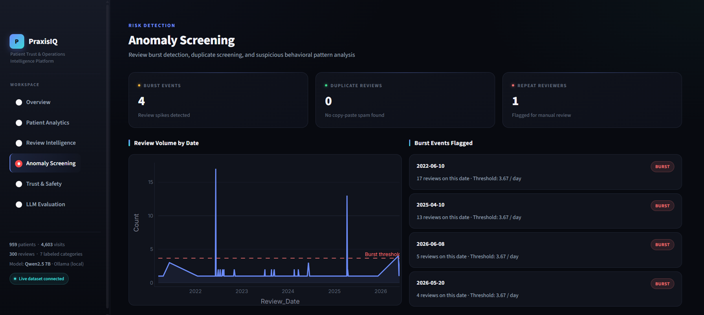
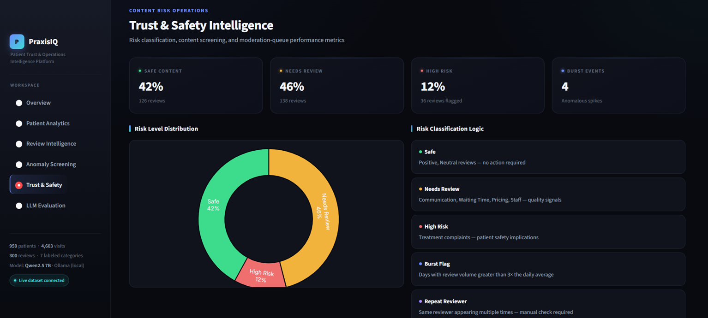
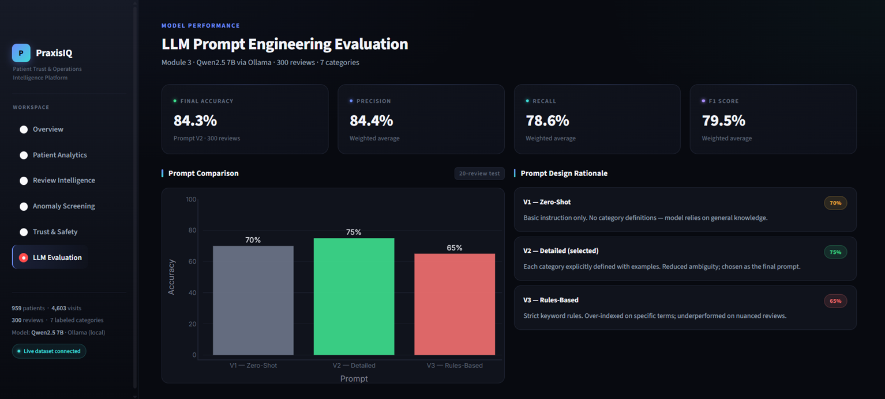
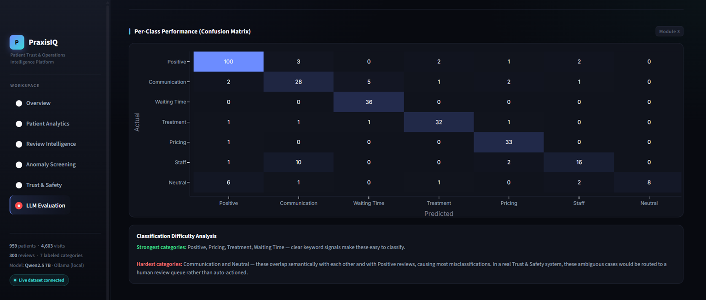

# PraxisIQ — Trust & Safety Analytics Platform

An end-to-end data analytics and LLM evaluation platform built to demonstrate
Trust & Safety engineering workflows, applied to a 6-year dental clinic dataset
of 959 patients, 4,603 visits, and 300 labeled reviews.

---

## Dashboard Preview

| Anomaly Screening | Trust & Safety Intelligence |
|---|---|
|  |  |

| LLM Prompt Evaluation | Confusion Matrix |
|---|---|
|  |  |

---

## Key Outcomes

| Result | Value |
|---|---|
| Review classification accuracy (LLM) | 84.33% |
| Prompt engineering iterations | 3 prompts evaluated and benchmarked |
| Review burst events detected | 4 anomalous spikes flagged |
| High-risk patient cases identified | 42 |
| Statistical visit outliers flagged | 31 |
| Repeat reviewer flagged | 1 (Yashoda S — 2 reviews, avg 2.5 stars) |
| Reviews in moderation queue | 300 across 3 risk tiers |
| ANOVA result | F = 5.37, p < 0.001 |

---

## Key Findings and Recommendations

These findings are written as analyst recommendations, directly mapping to Trust & Safety operational decisions.

**Finding 1 — Review burst events indicate coordinated or event-driven activity**
4 burst events were detected across the 6-year dataset (threshold: 3× daily average = 3.67 reviews/day). The largest spike occurred on 2022-06-10 with 17 reviews in a single day — 4.6× the daily average. A second spike on 2025-04-10 produced 13 reviews. Recommendation: implement a 24-hour elevated monitoring window following service launches or promotional events, as burst activity correlates with external triggers rather than organic review behavior.

**Finding 2 — Treatment complaints represent the highest patient safety risk**
36 reviews (12% of total) were classified as High Risk — all Treatment complaints with ratings of 1–2 stars. Sample signals include: "Filling procedure was painful throughout despite assurance it would be pain free" (R0048, Rating 1) and "Tooth condition worsened after treatment. Had to seek urgent care elsewhere" (R0121, Rating 1). Recommendation: auto-escalate any Treatment review rated 1–2 stars to a senior review queue within 24 hours. These are patient safety signals, not just quality feedback.

**Finding 3 — LLM outperforms rules-based classification on nuanced content**
Prompt V2 (detailed definitions with examples) achieved 84.33% accuracy on 300 reviews, outperforming V1 Zero-Shot (70%) and V3 Rules-Based (65%). The rules-based approach failed on nuanced reviews that contained multiple signals — for example, a review mentioning both pricing and treatment quality. Recommendation: use LLM classification (Prompt V2) for production, with human review routing for Communication and Neutral categories where misclassification rate is highest.

**Finding 4 — Communication and Neutral categories require human review routing**
The confusion matrix shows Communication and Neutral as the hardest categories to classify — Communication was misclassified as Staff in 10 of 39 cases, and Neutral was misclassified as Positive in 6 of 18 cases. These categories share semantic overlap that neither keyword rules nor LLM prompts resolve reliably. Recommendation: route all Communication and Neutral predictions to a human review queue rather than auto-actioning them.

**Finding 5 — 42 high-risk patients require follow-up intervention**
42 patients (4.4% of total) required follow-up treatment but did not complete it, with Root Canal producing the highest concentration of non-compliant cases. These represent active clinical risk. Recommendation: trigger an outreach workflow for any patient flagged Follow_Up_Required = Y and Follow_Up_Completed = N beyond 30 days.

---

## Data Labeling Methodology

300 Google Maps reviews were hand-labeled across 7 categories to serve as the ground-truth evaluation dataset for LLM prompt benchmarking.

**Category definitions used during labeling:**

| Category | Definition | Example signal |
|---|---|---|
| Positive | Overall satisfaction, general praise | "Excellent doctor, highly recommended" |
| Treatment | Complaints or feedback about clinical procedure quality | "Filling fell off after two weeks" |
| Communication | Feedback about how staff explained procedures or responded to concerns | "Doctor did not explain the side effects" |
| Waiting Time | Feedback about appointment delays or queue management | "Waited 45 minutes past appointment time" |
| Pricing | Feedback about cost, billing, or value for money | "Charged more than the quoted amount" |
| Staff | Feedback about non-clinical staff behavior | "Receptionist was rude and unhelpful" |
| Neutral | Factual statements with no clear positive or negative sentiment | "Visited for a routine checkup" |

**Labeling rules applied:**
- Reviews mentioning multiple signals were assigned to the primary complaint category (e.g. a review mentioning both pricing and treatment quality was labeled Treatment if the treatment complaint was the dominant signal)
- Ambiguous reviews defaulted to Neutral rather than Positive to avoid inflating the positive class
- Label distribution was checked for class imbalance before evaluation — Positive was the largest class (108 reviews), Neutral the smallest (18 reviews)
- All 300 labels were assigned by a single annotator to ensure consistency in boundary decisions. This is a known limitation: with only one labeler, there is no inter-annotator agreement (e.g. Cohen's kappa) to quantify labeling reliability, and any boundary bias in how that one person interpreted ambiguous cases (especially Communication vs Staff vs Neutral) propagates uncorrected into the evaluation set. A production labeling pipeline would use 2-3 annotators per item with a measured agreement score before trusting the ground truth.

---

## Why this maps to Trust & Safety

This project simulates the core analytical workflows in a T&S engineering role:

- **Content classification** — Designed and evaluated 3 LLM prompt versions using Qwen2.5 7B to classify user-generated reviews into 7 categories, with full precision, recall, and F1 analysis
- **Abuse detection** — Review burst analysis, exact duplicate screening, and repeat reviewer flagging using the same detection logic as spam and coordinated inauthentic behavior systems
- **Risk prioritization** — A moderation queue with Critical / High / Medium / Low severity tiers, directly mirroring real-world content escalation pipelines
- **Statistical modeling** — One-Way ANOVA (F = 5.37, p < 0.001) to identify significant behavioral differences across user segments
- **Data labeling** — 300 reviews hand-labeled across 7 categories to serve as the ground-truth evaluation dataset
- **Dashboard and reporting** — Interactive Streamlit dashboard across 6 analytical views for stakeholder communication

> **Domain note:** Patient reviews are structurally identical to user-generated content on any platform — free-text submissions, star ratings, coordinated posting patterns, and abuse signals. The workflows here directly mirror Trust & Safety systems at scale. The domain is dental; the methodology is platform trust and safety.

---

## Limitations and What Changes at Platform Scale

This project runs on 959 patients, 4,603 visits, and 300 labeled reviews — small enough to query with SQL batch jobs and label by hand. That methodology does not transfer directly to a platform like YouTube, and being explicit about what changes is part of the analysis:

- **Batch SQL → streaming detection.** Burst detection here runs as a periodic batch query against a static SQLite file. At platform scale, the same logic (volume vs. a rolling baseline) needs to run as a streaming job against live ingestion, with sub-minute latency rather than end-of-day reports.
- **Single annotator → labeling pipeline with agreement scoring.** 300 reviews labeled by one person works for a portfolio evaluation set. Production labeling at scale requires multiple annotators per item, a measured inter-annotator agreement score, and an adjudication process for disagreements — none of which this project has, and which is a real gap if this were a hiring claim rather than a demonstration of method.
- **Static thresholds → adaptive baselines.** The 3.67 reviews/day burst threshold and the 1-2 star Treatment auto-escalation rule are fixed constants tuned to this dataset. At scale, thresholds need to adapt per-entity (per channel, per creator) and shift over time as baseline behavior changes, rather than being one global constant.
- **300-row confusion matrix → continuous model monitoring.** The LLM evaluation here is a one-time benchmark on a fixed test set. A production classifier needs continuous accuracy monitoring against fresh human-reviewed samples, since both content patterns and model behavior drift over time.

The point of this project isn't that the dental clinic data *is* YouTube-scale Trust & Safety — it's that the analytical reasoning (volume-based abuse detection, severity-aware risk tiering, precision/recall tradeoffs in classification, human-review routing for ambiguous content) is the same reasoning, applied at a scale small enough to fully own end-to-end: from raw Excel data to a working dashboard.

---

## Tech Stack

| Tool | Purpose |
|---|---|
| Python | Core scripting and analytics |
| SQLite | Relational database and SQL querying |
| Pandas | Data manipulation and reporting |
| Scikit-Learn | ML classification, TF-IDF, metrics |
| SciPy | Statistical testing (ANOVA) |
| Qwen2.5 7B (Ollama) | Local LLM for prompt evaluation |
| Streamlit | Interactive dashboard |
| Plotly | Data visualizations |

---

## Project Modules

### Module 1 — Database Engineering
- Built SQLite database from raw Excel source data
- Cleaned and validated 959 patient records, 4,603 visit records, and 300 reviews
- Documented data quality issues (treatment naming inconsistencies: Root Canal / root Canal, Aligner / Aligners)

### Module 2 — SQL Analytics
Generated 8 analytical reports:

| Report | File |
|---|---|
| Common treatments by volume | `sql/01_common_treatments.sql` |
| Follow-up completion rates | `sql/02_completion_rates.sql` |
| Patient return rates | `sql/03_return_rates.sql` |
| Follow-up compliance | `sql/04_followup_compliance.sql` |
| Average visits per patient | `sql/05_average_visits.sql` |
| Treatment trends over time | `sql/06_treatment_trends.sql` |
| High-risk patient identification | `sql/07_high_risk_patients.sql` |
| Behavioral insights | `sql/08_behavioral_insights.sql` |

Statistical finding: One-Way ANOVA confirmed a statistically significant difference in visit frequency across treatment types (F = 5.3727, p < 0.001).

### Module 3 — LLM Prompt Engineering & Evaluation
Designed and benchmarked 3 prompt versions using Qwen2.5 7B via Ollama on 300 hand-labeled reviews:

| Prompt | Design Approach | Test Accuracy (20 reviews) |
|---|---|---|
| V1 — Zero-Shot | Basic category list only | 70% |
| V2 — Detailed | Category definitions with examples | 75% ← selected |
| V3 — Rules-Based | Strict keyword rules | 65% |

**Final evaluation — Prompt V2 on 300 reviews:**

| Metric | Score |
|---|---|
| Accuracy | 84.33% |
| Precision | 84.37% |
| Recall | 78.56% |
| F1 Score | 79.54% |

Strongest categories: Positive, Pricing, Treatment, Waiting Time
Hardest categories: Communication, Staff, Neutral (semantic overlap causes misclassification)

### Module 4 — Anomaly Detection & Investigation

| Investigation | Finding |
|---|---|
| Visit outlier detection | 31 patients with statistically unusual visit counts (mean + 2 SD) |
| Follow-up risk detection | 42 patients required follow-up but did not complete it |
| Treatment risk analysis | Root Canal produced the highest concentration of high-risk patients |
| Duplicate review detection | 0 copy-paste duplicates found |
| Review burst detection | 4 burst events detected (threshold: 3× daily average = 3.67 reviews/day) |
| Repeat reviewer detection | 1 repeat reviewer flagged (Yashoda S, 2 reviews, avg rating 2.5) |

### Module 5 — Trust & Safety Pipeline
7 SQL-based T&S workflows:

| Script | Purpose |
|---|---|
| `01_review_burst_detection.sql` | Flag days with anomalous review volume |
| `02_repeat_reviewer_detection.sql` | Identify users submitting multiple reviews |
| `03_negative_review_monitoring.sql` | Monitor negative content trends |
| `04_risk_prioritization.sql` | Priority-rank cases for investigation |
| `05_moderation_metrics.sql` | Queue performance and coverage metrics |
| `06_risk_scoring_engine.sql` | Composite risk score per review category |
| `07_emerging_risk_detection.sql` | Surface rising complaint patterns |

Risk tiers applied across 300 reviews:

| Tier | Count | Logic |
|---|---|---|
| Safe | 126 (42%) | Positive and Neutral reviews |
| Needs Review | 138 (46%) | Communication, Waiting Time, Pricing, Staff |
| High Risk | 36 (12%) | Treatment complaints — patient safety signals |

### Module 6 — Dashboard
Interactive Streamlit dashboard with 6 views:

- **Overview** — Executive KPIs and platform summary
- **Patient Analytics** — Retention, churn, follow-up compliance, ANOVA results
- **Review Intelligence** — Sentiment distribution, rating analysis, service quality
- **Anomaly Screening** — Burst events, outliers, duplicate detection
- **Trust & Safety** — Risk tiers, moderation queue, classification logic
- **LLM Evaluation** — Prompt comparison, confusion matrix, per-class F1

---

## How to Run

**Prerequisites:** Python 3.10+, pip, and Ollama installed locally.

```bash
# Install dependencies
pip install -r requirements.txt

# Step 1 — Build the database from raw Excel data
python create_database.py

# Step 2 — Run SQL analytics (open any file in sql/ with SQLite browser or run via Python)
# Example: python analytics/statistical_analysis.py

# Step 3 — Run LLM evaluation (requires Ollama running locally)
ollama pull qwen2.5:7b
python llm/llm_evaluation_final.py

# Step 4 — Run anomaly detection
python analytics/review_burst_detection.py
python analytics/duplicate_review_detection.py
python analytics/suspicious_reviewer_detection.py

# Step 5 — Run Trust & Safety pipeline
python trust_safety/moderation_queue.py
python trust_safety/risk_escalation_engine.py
python trust_safety/case_management_system.py

# Step 6 — Launch dashboard
streamlit run dashboards/app.py
```

---

## Repository Structure

```
PraxisIQ/
├── create_database.py          # Database builder from Excel source
├── requirements.txt            # Project dependencies
├── assets/                     # Dashboard screenshots
├── sql/                        # SQL analytics queries
│   ├── 01_common_treatments.sql
│   └── trust_safety/           # T&S specific SQL workflows
├── analytics/                  # Python analytics scripts
├── llm/                        # LLM prompt engineering and evaluation
├── ml/                         # Traditional ML classifier (TF-IDF + Logistic Regression)
├── trust_safety/               # T&S pipeline scripts
├── dashboards/                 # Streamlit dashboard
│   └── app.py
└── reports/                    # Generated CSV outputs
```