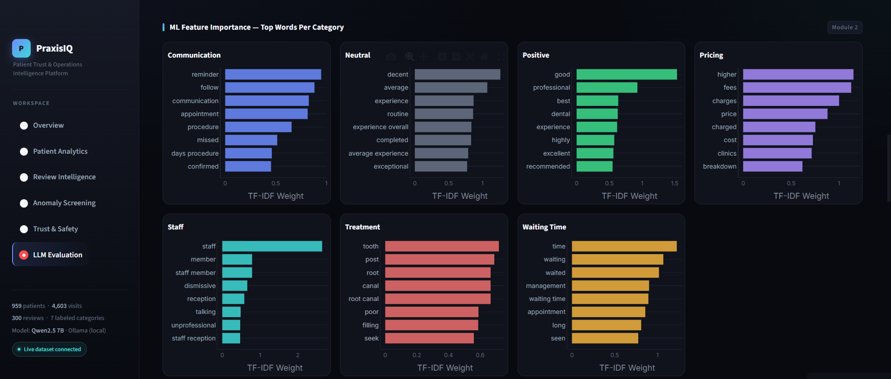
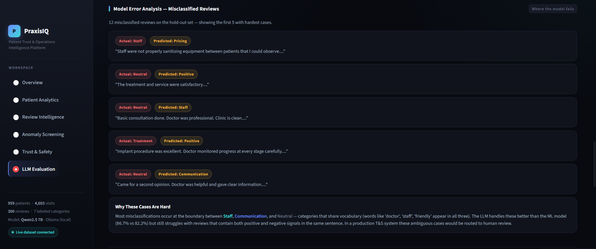
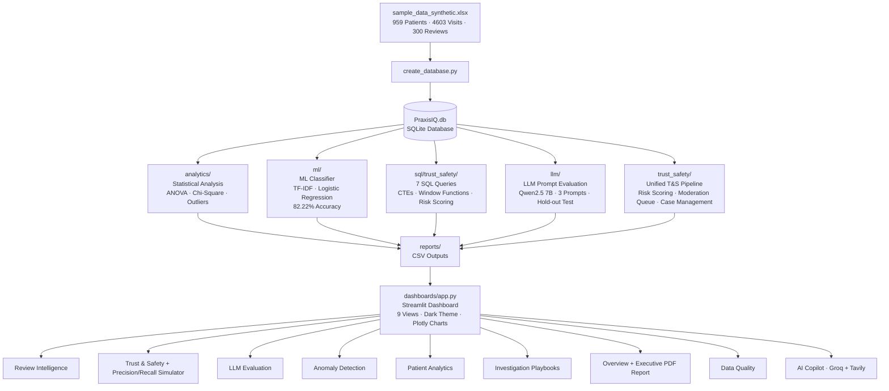
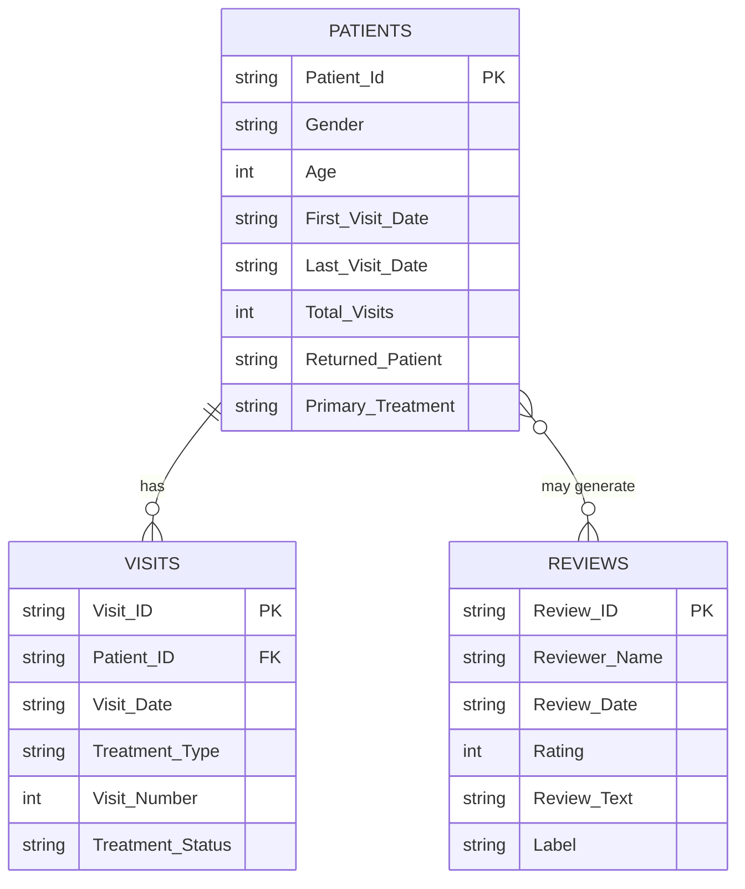

# PraxisIQ — Trust & Safety Analytics Platform

🔗 **Live Demo:** [https://praxisiq.streamlit.app](https://praxisiq.streamlit.app)

An end-to-end data analytics and LLM evaluation platform built to demonstrate
Trust & Safety engineering workflows, applied to a 6-year dental clinic dataset
of 959 patients, 4,603 visits, and 300 labeled reviews.

📋 See [METHODOLOGY.md](METHODOLOGY.md) for the reasoning behind key analytical decisions, and [FINDINGS.md](FINDINGS.md) for a summary of what the analysis found.

---

## Dashboard Preview

| Anomaly Screening | Trust & Safety Intelligence |
|---|---|
|  |  |

| LLM Evaluation | Confusion Matrix |
|---|---|
|  |  |

| ML Feature Importance | Model Error Analysis |
|---|---|
|  |  |

---

## Key Outcomes

| Result | Value |
|---|---|
| Review classification accuracy (ML — TF-IDF + Logistic Regression V2) | 82.22% |
| Review classification accuracy (LLM — Prompt V2, hold-out test set) | 86.67% |
| Prompt engineering iterations | 3 prompts evaluated (V1 Zero-Shot: 65.56%, V2 Detailed: 86.67%, V3 Rules-Based: 65.56%) |
| Precision/Recall Simulator | Live confusion matrix — TP/FP/FN/TN updates as threshold slider moves |
| Review burst events detected | 7 anomalous spikes flagged |
| High-risk patient cases identified | 173 (never returned after single visit) |
| Statistical visit outliers flagged | 31 (Z-score > 2σ) |
| Repeat reviewer flagged | 1 (Yashoda S — 2 reviews, avg 2.5 stars) |
| Reviews in moderation queue | 300 across 3 risk tiers |
| ANOVA result | F = 5.37, p < 0.001 |
| Critical cases (P1 — Immediate) | 34 |
| High priority cases (P2 — Same Day) | 111 |
| Data Quality Score | Computed live — missing values, duplicates, validation checks |
| AI Copilot | Groq Llama 3.1 8B + Tavily web search + live DB context |

---

## System Architecture



---

## Database Schema (ER Diagram)



> **Schema note:** Reviews have no Patient_ID foreign key — this is intentional and realistic. On real platforms (Google Maps, Yelp, Healthgrades), reviews are submitted by public users who are not necessarily registered patients in the clinic's system. All cross-table analysis therefore correlates at the treatment-type level rather than individual patient level, which mirrors how T&S analysts actually work when user identity is unverified.

---

## Data Dictionary

| Dataset | Description | Key Fields | Rows |
|---|---|---|---|
| Patients | Patient demographics and visit summary | Patient_ID, Age, Gender, Primary_Treatment, Returned_Patient, Total_Visits | 959 |
| Visits | Individual clinical visit records | Visit_ID, Patient_ID, Visit_Date, Treatment_Type, Treatment_Status, Visit_Number | 4,603 |
| Reviews | Patient-submitted text reviews with ground-truth labels | Review_ID, Reviewer_Name, Rating (1–5), Review_Text, Label, Review_Date | 300 |
| llm_predictions.csv | LLM hold-out test set predictions | Review_Text, Label (ground truth), Prediction, Correct, Split | 90 |
| moderation_queue.csv | Reviews classified by risk tier | Review_ID, Risk_Level, Priority, Label, Rating | 300 |
| followup_risk_queue.csv | At-risk patients flagged for follow-up | Patient_ID, Primary_Treatment, Risk_Category, Total_Visits | 173 |
| review_burst_detection.csv | Days flagged as anomalous review volume | Review_Date, Daily_Count, Rolling_Avg, Burst_Status | 7 burst days |
| trust_safety_metrics.csv | Aggregated T&S pipeline metrics | Category, Risk_Level, Priority, Count | Per category |

**Label definitions (Reviews.Label):**

| Label | Definition |
|---|---|
| Positive | Overall satisfaction or general praise |
| Treatment | Complaints about clinical procedure quality or outcomes |
| Communication | Feedback about how staff explained procedures or responded |
| Waiting Time | Feedback about appointment delays or queue management |
| Pricing | Feedback about cost, billing, or value for money |
| Staff | Feedback about non-clinical staff behavior |
| Neutral | Factual statements with no clear positive or negative sentiment |

---

## Key Findings and Recommendations

These findings are written as analyst recommendations, directly mapping to Trust & Safety operational decisions.

**Finding 1 — Review burst events indicate coordinated or event-driven activity**
7 burst events were detected across the 6-year dataset using dual-method detection: static threshold (mean + 2σ = 3.91 reviews/day) and rolling 7-day window (2× rolling average). The largest spike occurred on 2022-06-10 with 17 reviews in a single day — 13.9× the daily average. A second spike on 2025-04-10 produced 13 reviews. All burst days were positive-skewed (no negative burst campaigns detected). Recommendation: implement a 24-hour elevated monitoring window following service launches or promotional events, as burst activity correlates with external triggers rather than organic review behavior.

**Finding 2 — Treatment complaints represent the highest patient safety risk**
36 reviews (12% of total) were classified as High Risk — all Treatment complaints with ratings of 1–2 stars. Sample signals include: "Filling procedure was painful throughout despite assurance it would be pain free" (R0048, Rating 1) and "Tooth condition worsened after treatment. Had to seek urgent care elsewhere" (R0121, Rating 1). Recommendation: auto-escalate any Treatment review rated 1–2 stars to a senior review queue within 4 hours (P1 SLA). These are patient safety signals, not just quality feedback.

**Finding 3 — LLM outperforms rules-based classification on nuanced content**
Prompt V2 (detailed definitions with examples) achieved 86.67% accuracy on a held-out test set of 90 reviews (never used during prompt development), outperforming V1 Zero-Shot (65.56%) and V3 Rules-Based (65.56%). The rules-based approach failed on nuanced reviews that contained multiple signals. The ML baseline (TF-IDF + Logistic Regression) achieved 82.22% on the same test set — the LLM gains +4.45% by reasoning about context rather than token frequency. Recommendation: use LLM classification (Prompt V2) for production, with human review routing for Staff and Neutral categories where misclassification rate is highest.

**Finding 4 — Communication and Neutral categories require human review routing**
On the held-out test set, Staff recall dropped to 44% and Neutral to 40% — well below the 86.7% overall accuracy. These categories share semantic overlap that neither keyword rules nor LLM prompts resolve reliably. Recommendation: route all Staff and Neutral predictions to a human review queue rather than auto-actioning them. This is reflected in the confidence scoring system in the dashboard: Low-confidence predictions are flagged with "Route to human review."

**Finding 5 — 173 patients represent dropout risk requiring intervention**
173 patients (18% of total) never returned after their first visit. Of these, 73 are classified Critical — single visit, never returned, high-complexity treatment (Root Canal, Implant, Braces, etc.). Teeth Cleaning (100% dropout), Consultation (83.3%), and Scaling (64.7%) had the highest dropout rates. Recommendation: trigger an outreach workflow for any patient with a high-complexity treatment who has not returned within 30 days.

---

## Data Labeling Methodology

300 Google Maps reviews were hand-labeled across 7 categories to serve as the ground-truth evaluation dataset for LLM prompt benchmarking.

**Labeling rules applied:**
- Reviews mentioning multiple signals were assigned to the primary complaint category
- Ambiguous reviews defaulted to Neutral rather than Positive to avoid inflating the positive class
- Label distribution was checked for class imbalance before evaluation — Positive was the largest class (108 reviews), Neutral the smallest (18 reviews)
- All 300 labels were assigned by a single annotator to ensure consistency in boundary decisions. **Known limitation:** with only one labeler, there is no inter-annotator agreement score (e.g. Cohen's kappa). A production labeling pipeline would use 2–3 annotators per item with a measured agreement score before trusting the ground truth.

---

## Why this maps to Trust & Safety

This project simulates the core analytical workflows in a T&S engineering role:

- **Content classification** — Designed and evaluated 3 LLM prompt versions using Qwen2.5 7B to classify user-generated reviews into 7 categories, with full precision, recall, and F1 analysis
- **Abuse detection** — Review burst analysis (dual-method: static + rolling), exact duplicate screening, and repeat reviewer flagging using the same detection logic as spam and coordinated inauthentic behavior systems
- **Risk prioritization** — A moderation queue with Critical / High / Medium / Low severity tiers, directly mirroring real-world content escalation pipelines
- **Experiment design** — Live precision/recall simulator: adjust the Treatment escalation threshold and see real TP/FP/FN/TN update from ground-truth data — directly demonstrating policy experiment thinking
- **Investigation playbooks** — Structured Detection → Evidence → Severity → Action → Escalation → Resolution workflows for 5 issue types, mirroring T&S operational runbooks
- **Statistical modeling** — One-Way ANOVA (F = 5.37, p < 0.001) and Chi-Square (χ² = 412.49, p < 0.001) to identify significant behavioral differences across segments
- **AI-assisted analytics** — Groq-powered AI Copilot with live database context answers analyst questions: "What treatment has the highest risk?", "Summarize the moderation queue", "Why did complaints increase?"
- **Data labeling** — 300 reviews hand-labeled across 7 categories to serve as the ground-truth evaluation dataset
- **Executive reporting** — One-click PDF report generation with live KPI snapshot, top findings, moderation queue status, and model performance summary

> **Domain note:** Patient reviews are structurally identical to user-generated content on any platform — free-text submissions, star ratings, coordinated posting patterns, and abuse signals. The workflows here directly mirror Trust & Safety systems at scale. The domain is dental; the methodology is platform trust and safety.

---

## Limitations and What Changes at Platform Scale

This project runs on 959 patients, 4,603 visits, and 300 labeled reviews — small enough to query with SQL batch jobs and label by hand. That methodology does not transfer directly to a platform like YouTube, and being explicit about what changes is part of the analysis:

- **Batch SQL → streaming detection.** Burst detection here runs as a periodic batch query against a static SQLite file. At platform scale, the same logic needs to run as a streaming job against live ingestion, with sub-minute latency rather than end-of-day reports.
- **Single annotator → labeling pipeline with agreement scoring.** 300 reviews labeled by one person works for a portfolio evaluation set. Production labeling at scale requires multiple annotators per item, a measured inter-annotator agreement score (Cohen's Kappa), and an adjudication process for disagreements.
- **Static thresholds → adaptive baselines.** The 3.91 reviews/day burst threshold and the 1–2 star Treatment auto-escalation rule are fixed constants tuned to this dataset. At scale, thresholds need to adapt per-entity and shift over time as baseline behavior changes. The threshold simulator in the dashboard demonstrates this tradeoff explicitly.
- **300-row confusion matrix → continuous model monitoring.** The LLM evaluation here is a one-time benchmark on a fixed test set. A production classifier needs continuous accuracy monitoring against fresh human-reviewed samples, since both content patterns and model behavior drift over time.
- **Confidence scoring from signals → calibrated probabilities.** The confidence tiers in the dashboard (High / Medium / Low) are derived from per-class recall signals because Qwen2.5 via Ollama returns a label string, not a logit. A production system would use a calibrated classifier that returns actual probability scores for threshold-based routing.

---

## ML Model — Two-Version Comparison

Two models were built iteratively on the same 300-review dataset (210 train / 90 test, stratified 70/30 split):

| | Model V1 (Baseline) | Model V2 (Final) |
|---|---|---|
| Vectorization | TF-IDF (unigrams) | TF-IDF (unigrams + bigrams) |
| Class balancing | None | class_weight='balanced' |
| Accuracy | 68.33% | **82.22%** |
| Macro F1 | 0.57 | **0.78** |

V2 improvements: bigrams captured multi-word clinical phrases ("waiting time", "root canal"); class balancing corrected Positive-class dominance. Weakest categories remain Staff (F1: 0.53) and Neutral (F1: 0.50) due to semantic overlap — these benefit most from LLM classification.

---

## Tech Stack

| Tool | Purpose |
|---|---|
| Python | Core scripting and analytics |
| SQLite | Relational database and SQL querying |
| Pandas | Data manipulation and reporting |
| Scikit-Learn | ML classification, TF-IDF, metrics |
| SciPy | Statistical testing (ANOVA, Chi-Square) |
| Qwen2.5 7B (Ollama) | Local LLM for prompt evaluation |
| Groq (Llama 3.1 8B) | AI Copilot — live analyst Q&A |
| Tavily Search API | Web search integration in AI Copilot |
| Streamlit | Interactive dashboard |
| Plotly | Data visualizations |

---

## Project Modules

### Module 1 — Database Engineering
- Built SQLite database from raw Excel source data
- Cleaned and validated 959 patient records, 4,603 visit records, and 300 reviews
- Documented data quality issues (treatment naming inconsistencies: Root Canal / root Canal, Aligner / Aligners)

### Module 2 — SQL Analytics
11 analytical SQL queries across two folders:

| Report | File |
|---|---|
| Common treatments by volume | `sql/01_common_treatments.sql` |
| Treatment completion rates + ranking | `sql/02_completion_rates.sql` |
| Patient return rates | `sql/03_return_rates.sql` |
| Dropout compliance by treatment | `sql/04_followup_compliance.sql` |
| Average visits per patient | `sql/05_average_visits.sql` |
| Treatment trends over time | `sql/06_treatment_trends.sql` |
| High-risk patient identification | `sql/07_high_risk_patients.sql` |
| Behavioral insights | `sql/08_behavioral_insights.sql` |
| Dropout + review correlation | `sql/09_high_risk_treatment_review_correlation.sql` |
| Completion vs sentiment vulnerability | `sql/10_treatment_completion_vs_review_sentiment.sql` |
| Unified patient risk profile | `sql/11_patient_risk_profile.sql` |

Statistical finding: One-Way ANOVA confirmed a statistically significant difference in visit frequency across treatment types (F = 5.3727, p < 0.001).

### Module 3 — LLM Prompt Engineering & Evaluation

**Evaluation methodology (anti-data-leakage design):**
- 300 reviews split before any prompt was written: 210 development (70%) / 90 hold-out test (30%)
- Prompts V1, V2, V3 were iterated only on the development set
- Final accuracy numbers are from the hold-out test set only

| Prompt | Design Approach | Hold-Out Test Accuracy (90 reviews) |
|---|---|---|
| V1 — Zero-Shot | Basic category list only | 65.56% |
| V2 — Detailed | Category definitions with examples | **86.67% ← selected** |
| V3 — Rules-Based | Strict keyword rules | 65.56% |

**Final metrics — Prompt V2 on held-out test set:**

| Metric | Score |
|---|---|
| Accuracy | 86.67% |
| Precision | 85.51% |
| Recall | 80.85% |
| F1 Score | 80.71% |

Strongest: Waiting Time (F1 0.96), Positive (0.92), Pricing (0.91), Communication (0.89)
Weakest: Staff (F1 0.53), Neutral (0.57) — both routed to human review

### Module 4 — Anomaly Detection & Investigation

| Investigation | Finding |
|---|---|
| Visit outlier detection | 31 patients with statistically unusual visit counts (mean + 2σ = 11.56 visits) |
| Dropout risk detection | 173 patients never returned · 73 Critical (high-complexity, single visit) |
| Treatment risk analysis | Teeth Cleaning 100% dropout · Consultation 83.3% · Scaling 64.7% |
| Duplicate review detection | 0 copy-paste duplicates found — clean baseline confirmed |
| Review burst detection | 7 burst events detected (4 static + 3 rolling-only) |
| Repeat reviewer detection | 1 repeat reviewer flagged (Yashoda S, 2 reviews, avg rating 2.5) |
| Emerging risk monitoring | All 5 complaint categories declining or stable QoQ as of 2026 |

### Module 5 — Trust & Safety Pipeline

**7 SQL-based T&S workflows (`sql/trust_safety/`):**

| Script | Purpose | Key Technique |
|---|---|---|
| `01_review_burst_detection.sql` | Flag days with anomalous review volume | 7-day rolling avg, LAG() |
| `02_repeat_reviewer_detection.sql` | Identify users submitting multiple reviews | RANK(), rating spread |
| `03_negative_review_monitoring.sql` | Monitor negative content trends MoM | LAG(), MoM growth % |
| `04_risk_prioritization.sql` | Priority-rank cases for investigation | ROW_NUMBER(), composite score |
| `05_moderation_metrics.sql` | Queue performance and coverage metrics | Weekly trends, cumulative SUM |
| `06_risk_scoring_engine.sql` | Composite risk score per review category | Severity × Rating × Recency × Velocity |
| `07_emerging_risk_detection.sql` | Surface rising complaint patterns | NTILE(), 3-month rolling avg |

**Unified Python pipeline (`trust_safety/trust_safety_pipeline.py`):**

Risk tiers applied across 300 reviews:

| Tier | Count | Logic |
|---|---|---|
| Safe | 126 (42%) | Positive and Neutral reviews |
| Needs Review | 138 (46%) | Communication, Waiting Time, Pricing, Staff |
| High Risk | 36 (12%) | Treatment complaints — patient safety signals |

Severity breakdown: 34 Critical (P1), 111 High (P2), 29 Medium (P3), 18 Low (P4), 108 Safe (P5)

### Module 6 — Dashboard
Interactive Streamlit dashboard with **9 views** — live at [https://praxisiq.streamlit.app](https://praxisiq.streamlit.app):

- **Overview** — Executive KPIs with trend context, delta indicators, and one-click Executive PDF Report
- **Patient Analytics** — Retention, churn, dropout risk queue, treatment dropout rates, ANOVA results
- **Review Intelligence** — Sentiment distribution, rating analysis, service quality by category
- **Anomaly Screening** — Burst events (dual-method), visit outliers, emerging risk category trends
- **Trust & Safety** — Risk tiers, moderation queue, threshold experiment simulator, live precision/recall simulator with confusion matrix, product vulnerability analysis
- **LLM Evaluation** — Prompt comparison, ML vs LLM, feature importance, confidence scoring, model error analysis, confusion matrix
- **Investigation Playbooks** — 5 structured playbooks (Review Burst, Treatment Complaint, Suspicious Reviewer, Duplicate Review, Emerging Risk) each with Detection → Evidence → Severity → Action → Escalation → Resolution workflow
- **Data Quality** — Missing value rates, duplicate detection, treatment standardization, overall data quality score
- **AI Copilot** — Groq Llama 3.1 8B with live DB context + Tavily web search. Ask: "What treatment has the highest risk?", "Summarize the moderation queue", "Best dental clinics in Trichy?"

---

## How to Run Locally

**Prerequisites:** Python 3.10+, pip

```bash
# Install dependencies
pip install -r requirements.txt

# Step 1 — Build the database
python create_database.py

# Step 2 — Run the full pipeline (recommended)
python run_all.py

# Or run individual modules:
python trust_safety/trust_safety_pipeline.py
python analytics/statistical_analysis.py
python analytics/treatment_risk_analysis.py

# Step 3 — Run LLM evaluation (requires Ollama)
ollama pull qwen2.5:7b
python llm/llm_evaluation_final.py

# Step 4 — Launch dashboard
streamlit run dashboards/app.py
```

**AI Copilot setup** (required for the Copilot page):
1. Get a free Groq API key at [console.groq.com/keys](https://console.groq.com/keys)
2. Get a free Tavily API key at [app.tavily.com](https://app.tavily.com)
3. Create `.streamlit/secrets.toml` in the project root:
```toml
GROQ_API_KEY = "gsk_your_key_here"
TAVILY_API_KEY = "tvly_your_key_here"
```

---

## Repository Structure

```
PraxisIQ/
├── create_database.py              # Database builder from Excel source
├── run_all.py                      # Single entry point — runs full pipeline
├── config.py                       # Central config: thresholds, paths, logging
├── requirements.txt                # Project dependencies
├── README.md
├── FINDINGS.md                     # Analyst findings document
├── METHODOLOGY.md                  # Decision rationale for every technique
├── SETUP.md                        # Local setup guide
├── CHANGELOG.md                    # Version history
├── LICENSE                         # MIT License
├── sample_data_synthetic.xlsx      # Synthetic source data (959 patients, 4603 visits, 300 reviews)
├── assets/                         # Dashboard screenshots
├── sql/                            # SQL analytics queries
│   ├── 01_common_treatments.sql
│   └── trust_safety/               # 7 T&S specific SQL workflows
├── analytics/                      # Python analytics scripts
├── llm/                            # LLM prompt engineering and evaluation
├── ml/                             # ML classifier (TF-IDF + Logistic Regression)
├── trust_safety/                   # Unified T&S pipeline
├── tests/                          # Unit tests (pytest)
│   └── test_pipeline.py            # 10 test cases covering core pipeline logic
├── dashboards/                     # Streamlit dashboard
│   └── app.py                      # 9 pages · 3500+ lines
└── reports/                        # Generated CSV outputs (gitignored)
```